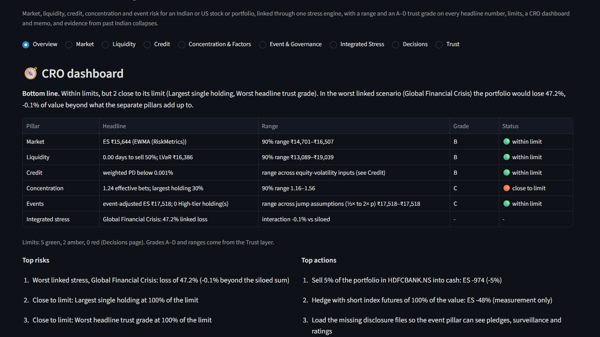
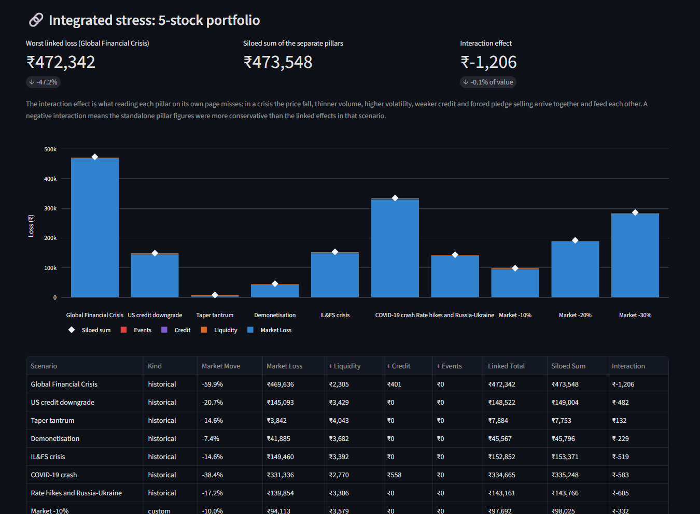
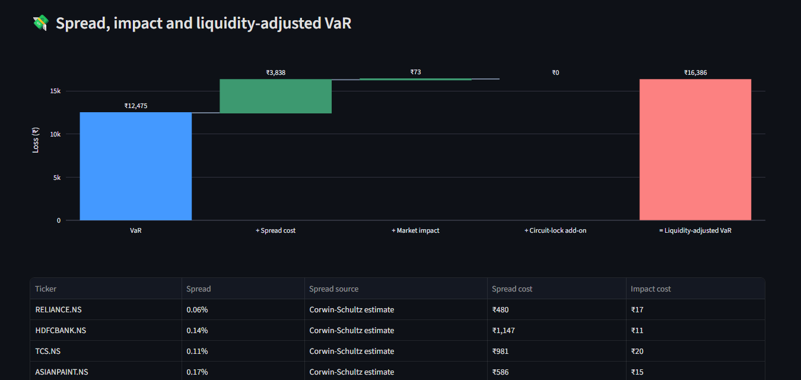
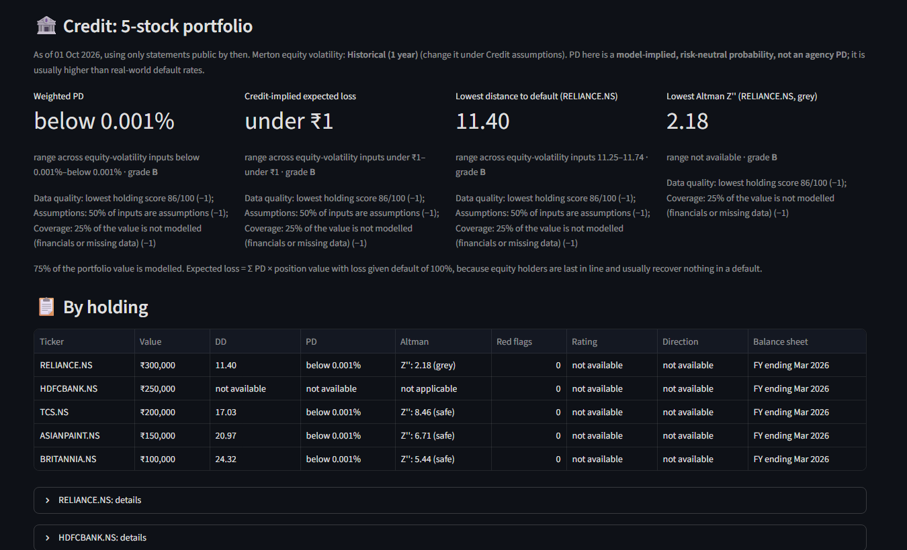
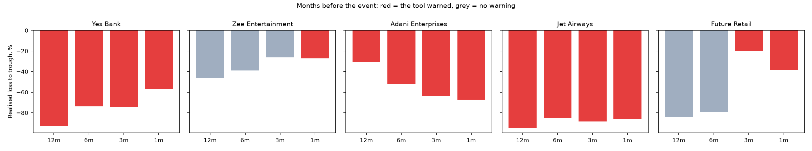

# Risk Analysis Tool

[](https://github.com/singhwilliam15/RIsk-Analysis-Tool/actions/workflows/tests.yml)

[](LICENSE)

**▶ Live demo: [var-analysis-tool-jb48f2b7syny4j2vzeartr.streamlit.app](https://var-analysis-tool-jb48f2b7syny4j2vzeartr.streamlit.app/)**. Try any NSE, BSE or US ticker, or switch to Portfolio mode. The app may take about 30 seconds to wake up if nobody has used it recently.

A risk dashboard for a single stock or a multi-stock portfolio on NSE, BSE or US markets. It is being extended from market risk into a full risk analysis tool with five pillars: market, liquidity, credit, concentration & factor, and event & governance risk.

The pillars are linked through one integrated stress engine, because in a real crisis they hit together. Every headline number carries a 90% range and an A–D trust grade with its reasons. The plan, phase by phase, is in [RISK_TOOL_PLAN_V3.md](RISK_TOOL_PLAN_V3.md).

**Market risk** is complete. It estimates Value at Risk (VaR) and Expected Shortfall (ES) with eight models, from historical simulation to GARCH(1,1) with Student-t errors. It then **tests which model can be trusted**:
- every model is backtested out of sample with the Kupiec, Christoffersen and McNeil-Frey (ES) tests;
- models are ranked on tick loss, not p-values;
- portfolio risk is split across holdings with an exact Euler allocation;
- crisis scenarios are measured from real index data and replayed through the position's actual returns.

The **shared data layer** is in place for the coming pillars:
- positions entered as weights, shares or values;
- OHLCV prices, with NSE and BSE volume combined;
- annual fundamentals with a source on every figure;
- loaders for official Indian disclosures (pledges, ASM/GSM, price bands, F&O ban, ratings, auditor events);
- a data-quality score for every holding.

The **trust layer** shows how far each number can be relied on:
- a 90% range for every model's VaR and ES, from a block bootstrap or GARCH parameter draws;
- an A–D grade from written rules, with the reasons for every deduction;
- the model-risk add-on across the models that pass the backtests;
- ES on 1-year, 2-year, 5-year and full-history windows;
- a "ghost effect" detector for Historical VaR.

**Liquidity risk** asks how fast the positions could be sold, and at what cost:
- days to liquidate at a participation rate;
- a SEBI/AMFI-style stress test (days to sell 25% and 50% pro rata);
- volume in past crises;
- a Corwin-Schultz spread estimate, Bangia spread cost and square-root-law impact, combined in a liquidity-adjusted VaR waterfall;
- Amihud illiquidity;
- circuit-lock risk for Indian stocks (the loss if a stock locks at its lower circuit for several days).

**Credit risk** looks at how close each company is to default, from its share price and from its accounts:
- Merton distance to default and a model-implied (risk-neutral) PD under three equity-volatility inputs;
- an iterative KMV cross-check;
- distance to default month by month, using only the balance sheets public at each date;
- Altman Z and Z'', never computed from partial inputs;
- credit ratios with red flags;
- rating actions;
- a separate panel for banks and insurers;
- the portfolio's weighted PD and credit-implied expected loss.

**Concentration and factor risk** shows what the portfolio is really exposed to:
- Fama-French 3-factor + momentum regressions with Newey-West t-statistics, using IIM Ahmedabad's Indian factors or Kenneth French's US factors;
- an exact split of portfolio variance and VaR into factors and stock-specific risk;
- HHI, sector risk shares, and Meucci's effective number of bets;
- how much diversification survives the correlations seen in past crises.

**Event and governance risk (India)** turns official disclosures into an early-warning tier:
- promoter pledges, ASM/GSM surveillance, the F&O ban list, rating downgrades and auditor events, all point in time;
- the credit pillar's distance-to-default trend and the liquidity pillar's circuit history;
- group tags you enter yourself;
- a Low / Elevated / High tier from written rules;
- the share-price fall at which pledged shares could be sold by lenders;
- a jump overlay showing how much event risk adds to ES.

**Integration and decisions** tie the pillars together:
- a **linked stress engine** runs each past crisis, and market falls of −10/−20/−30%, through market, liquidity, credit and event effects at once, and compares the result with the siloed sum of the separate pages;
- a **reverse stress test** finds the most plausible one-month shock that loses 10–30%, in stock space and in macro space (Nifty, Bank Nifty, Nifty IT, USD/INR, Brent), with the nearest historical analogue;
- a **Shapley explanation** of what changed in ES;
- the **best risk-reducing trades**, with their side-effects on the other pillars, and an index hedge;
- **limits** with traffic lights;
- a **CRO dashboard** on the Overview page and a **one-page CRO memo** (PDF and Markdown, written by rules with no language model).

Results export to a formatted Excel report. Built in Python with Streamlit, and covered by 434 offline tests in CI.

| Page | Status |
| --- | --- |
| Overview | Built: the CRO dashboard (pillar rows with range, grade and limit status; top risks and actions; memo), then summary cards, positions, data quality, fundamentals and their sources, and disclosure files. |
| Integrated Stress | Built: linked stress vs siloed sum for every scenario, and reverse stress (asset and macro space, nearest analogue). |
| Decisions | Built: limits, Shapley risk-change waterfall with snapshots, ES by holding, best trades, index hedge, CRO memo. |
| Market | Built: every model (with 90% range and grade), backtest, portfolio, stress and export tab. |
| Liquidity | Built: capacity, AMFI-style stress test, crisis volume, spread and impact cost, LVaR waterfall, Amihud, circuit-lock. |
| Credit | Built: Merton DD/PD (three volatility inputs, KMV cross-check, month-end history), Altman Z/Z'', ratios and red flags, ratings, a bank panel, weighted PD and expected loss. |
| Concentration & Factors | Built: factor exposures, the factor/specific risk split, HHI, sector risk, PCA and effective bets, crisis correlation, rolling betas. |
| Event & Governance | Built: early-warning panel, event-risk tier, pledge margin calls, jump overlay on ES. It needs your disclosure files for most signals. |
| Trust | Built: ranges, grades, model risk, lookback sensitivity, ghost effect. |
| Integrated Stress · Decisions | Coming next (Phase 6) |

### How far to trust the numbers (live data to 30 Sep 2026, 95% 1-day ES on ₹10 lakh, 2-year lookback)

| Position | Headline model | ES (90% range) | Grade | Main deductions |
| --- | --- | --- | --- | --- |
| Reliance | EWMA | ₹25,613 (₹24,068–₹27,486) | B | models disagree by 17%; 499 returns; λ is assumed |
| HDFC Bank | EWMA | ₹26,835 (₹25,106–₹28,711) | D | EWMA is recommended on the VaR tests but fails the ES test; only FHS passes both |
| Asian Paints | GARCH(1,1)-t | ₹30,088 (₹25,319–₹33,781) | B | range 28% wide; models disagree by 24% |
| Jaiprakash Power | GARCH(1,1)-t (fit failed, shows EWMA) | ₹42,071 (₹34,497–₹49,313) | C | models disagree by 137% (Student-t ₹93,296 vs FHS ₹35,773) |
| 5-stock portfolio | EWMA | ₹16,125 (₹15,165–₹17,114) | B | 499 returns; λ is assumed; HDFC Bank's data score |

### Credit (live data and Yahoo statements to FY Mar 2026, as of 1 Oct 2026)

| Company | Distance to default (range across volatility inputs) | Merton PD | Altman (primary) | Red flags |
| --- | --- | --- | --- | --- |
| Reliance | 11.40 (11.25–11.74) | below 0.001% | Z'' 2.18, **grey** (Z 1.90, grey) | none |
| TCS | 17.03 (14.48–18.82) | below 0.001% | Z'' 8.46, safe | none |
| Asian Paints | 20.97 (20.73–26.56) | below 0.001% | Z'' 6.71, safe | none |
| Britannia | 24.32 (22.71–28.69) | below 0.001% | Z'' 5.44, safe | none |
| Jaiprakash Power | 4.23 (4.23–6.69; GARCH fit failed) | 0.001% | Z'' 3.75, safe, **but Z 1.77, distress** | none |
| HDFC Bank | not modelled (bank) | – | not applicable | – |

- **Large caps are far from default on Merton.** Their default points are small relative to market value, so PDs are around 10⁻³⁰ and mean nothing on their own. The tool shows "below 0.001%" and grades their uncertainty on the distance-to-default scale instead.
- **Accounts and market can disagree.** Reliance's market-based distance to default is 11.4, but its accounts put it in Altman's grey zone. Its working capital is only 2.4% of total assets, and EBIT is 6.8% of a very large asset base. Jaiprakash Power is safe on Z'' but in distress on the 1968 manufacturers' Z. The page shows both.
- **Banks are not forced into these models.** HDFC Bank (25% of the default portfolio) gets a manual panel instead, so the portfolio PD covers 75% of the value and says so.

### Concentration and factors (default 5-stock portfolio; Indian factors to 31 Dec 2025)

- **Five stocks, 1.24 effective bets.** The first principal component, essentially the market, carries 95% of the portfolio's variance. HHI 0.225 suggests 4.4 effective holdings, but they move together.
- **The market factor is 65% of the risk** (portfolio beta 0.77), and stock-specific risk is 35%. Size, value and momentum net to almost nothing; the value tilt is a slight hedge (−2%).
- **Crisis correlation.** In past crisis windows the average correlation doubled, from 0.18 to 0.37, so only 69% of the diversification benefit survived. Picking the market's worst days instead shows no rise (0.19), a known statistical bias that the page explains.
- **Factor tilts differ widely.** Jaiprakash Power loads on size (+1.37) and value (+1.12). TCS and Britannia have significant negative value loadings, and Reliance has a market beta of 0.96 (t = 14).

## Screenshots

Default 5-stock NSE portfolio, ₹10 lakh, live data to 1 Oct 2026.

**CRO dashboard (Overview):** one row per pillar with its range, trust grade and limit status, plus top risks and actions.


**Integrated stress:** each crisis through every pillar at once, against the siloed sum of the separate pages.


**Liquidity-adjusted VaR:** VaR + spread cost + market impact + circuit-lock add-on.


**Credit:** Merton distance to default, risk-neutral PD and Altman Z'' per holding; the bank is not forced into the model.


## Did it see it coming?

The tool was run as of 12, 6, 3 and 1 month(s) before real Indian collapses, using only data public on each date. The results were compared with what happened, and with 10 large stable stocks at the same dates. Full method, results and the download checklist are in **[docs/case_studies.md](docs/case_studies.md)**. Only price-based pillars could be assessed so far: credit needs pre-2023 statements, and events need disclosure files, neither of which is loaded yet.

| Case | 12 months before | 6 months | 3 months | 1 month | Realised loss after 12m date |
| --- | --- | --- | --- | --- | --- |
| Yes Bank (RBI moratorium, Mar 2020) | warned | warned | warned | warned | −93% |
| Zee Entertainment (pledge collapse, Jan 2019) | missed | missed | missed | warned | −46% |
| Adani Enterprises (Hindenburg report, Jan 2023) | warned* | warned* | warned* | warned* | −30% |
| Jet Airways (flights suspended, Apr 2019) | warned | warned | warned | warned | −95% |
| Future Retail (sold after defaults, Aug 2020) | missed | missed | warned (circuits) | warned (circuits) | −84% |
| DHFL (bond default, Jun 2019) | not available: delisted, no prices on Yahoo | | | | |

- **Hit rate 15 of 20 case dates; false-positive rate 19 of 200 control dates (9.5%).** Most false positives come from 2-year windows that contain the March 2020 crash.
- **\*Adani warned only because it was always volatile.** Its ES was above 5% at every date; that is not a specific early signal.
- **Stocks already falling show up in prices** (Yes Bank, Jet Airways).
- **Pledge- and debt-driven collapses do not show up in prices until late** (Zee, and Future Retail for six months). That is the case for the event and credit pillars, which cannot be credited until their files are loaded.
- **Future Retail is where the liquidity pillar paid off.** From May 2020 it was locked at its lower circuit on 26–37 days (18 in a row), which a VaR model alone does not show.



### Integrated stress (live data to 1 Oct 2026)

| Position | Worst linked scenario | Linked loss | Siloed sum | Interaction |
| --- | --- | --- | --- | --- |
| 5-stock portfolio, ₹10 lakh | Global Financial Crisis | ₹4,72,342 (47.2%) | ₹4,73,548 | −₹1,206 |
| 5-stock portfolio, ₹50 crore | Global Financial Crisis | ₹23.72 crore | ₹23.76 crore | −₹3.4 lakh |
| Jaiprakash Power, ₹10 lakh | Market −10% | ₹2,38,629 | ₹1,11,621 | **+₹1,27,008** |

- **For liquid large-caps the pillars barely interact:** at most 0.12% of value in any scenario. Their crisis liquidity, credit and event costs are small next to the market loss.
- **For a small-cap with a price band they interact strongly.** Jaiprakash Power's 10.9% fall breaches its 5% band (inferred from history). The resulting freeze costs more than the market move itself, a loss no single pillar shows. It rests on the inferred band and the 3-day freeze floor.
- **Reverse stress:** the most plausible way for the portfolio to lose 15% in a month is Nifty −15.6%, Bank Nifty −15.3%, Nifty IT −17.7%, USD/INR +1.5% and Brent +8.8%. The nearest historical analogue is 6 Jun – 8 Jul 2008 (portfolio −12.5%). A move that far out has a 9.6% chance under a multivariate Student-t, against 1.8% under a normal.
- **Trades trade off across pillars:** switching 5% from HDFC Bank into Asian Paints trims ES by 0.2% but nearly doubles the days needed to sell 50% (₹50 crore portfolio).

### Event risk (as of 1 Oct 2026, no disclosure files loaded yet)

- **Every default holding is Low, but on only 1–2 of 8 signals.** These are the Merton trend and the circuit history; HDFC Bank, as a bank, has only the circuit history. The page says so, and each grade loses 2 points for the missing data. The tool never reads missing data as "no risk".
- **The jump assumptions matter a lot.** On Reliance's actual one-day distribution, a High tier (0.5% a day chance of −20%) would raise 99% ES from ₹42,872 to ₹1,24,904. That is why Phase 7 tests these defaults against real collapses before they are trusted.
- **Margin-call trigger:** at 2.0× initial and 1.5× trigger cover, lenders could invoke pledged shares after a 25% fall (Reliance at ₹876).

### Liquidity (live data to 1 Oct 2026, 20% participation)

- **₹10 lakh is liquid everywhere.** Every position is under 0.11% of a day's volume, so spread cost dominates impact. For Reliance, VaR ₹20,858 + spread ₹1,601 + impact ₹104 gives a liquidity-adjusted VaR of ₹22,563.
- **Circuit-lock risk dominates for a small-cap.** Jaiprakash Power (₹15 a share) has an inferred 5% band. Three lower circuits in a row (the 3-day floor; its longest past run was 1) would cost ₹1,42,625. That lifts its liquidity-adjusted VaR to ₹1,45,714 from a VaR of ₹33,548. The grade flags that both inputs are assumptions.
- **₹50 crore makes the pillar bite.** The 5-stock portfolio would need 0.09 days to sell 50% pro rata under the AMFI convention, and 0.21 days without the exclusion (Asian Paints binds, at 4.2% of a day's volume). Spread and impact add ₹27 lakh to VaR, giving a liquidity-adjusted VaR of ₹89.8 lakh (90% range ₹71.6–₹103.6 lakh).
- **Crises raise large-cap volume.** Median crisis-window volume was 1.08–1.32× the preceding four months for Reliance, HDFC Bank, TCS and Asian Paints, and 0.84× for Britannia. The tool never assumes a crisis makes selling easier, so it caps the factor at 1.

## Key findings

From live Yahoo Finance data, 5-year lookback, run on 1 Oct 2026:

- **Model choice moves the number by 79%.** Apple's 1-day 99% VaR on US$1m ranges from $34,574 (EWMA) to $61,838 (Cornish-Fisher) across the eight models.
- **GARCH(1,1)-t wins for Apple.** It is recommended at both 99% and 97.5%: the lowest out-of-sample tick loss among the models that pass every VaR test.
- **The ES backtest catches what VaR tests miss.** At 97.5%, EWMA passes all three VaR tests on Apple, but its ES is rejected (p < 0.001). For both stocks at both levels, the ES test rejects exactly the two normal-tailed models, Normal and EWMA.
- **√t overstates Apple's 10-day risk by 30%.** √t gives $152,071 against $116,860 from actual 10-day returns; a GARCH-t Monte Carlo gives $109,129.
- **A single beta misses real crisis behaviour.** Replayed through actual prices, Asian Paints fell 25% in the 2008 crash (Nifty −60%) but 18% after demonetisation (Nifty −7%).
- **Diversification cuts tail risk by 37%** in a five-stock NSE portfolio: Historical ES ₹31,000 → ₹19,496.
- **The data are checked too.** Yahoo's full Reliance history contains a +337% one-day spike that reverses the next day; the app flags it as a likely data error.

## What it does

| Area | What you get |
| --- | --- |
| **Models** | Historical, Normal, Student-t (maximum likelihood), Cornish-Fisher (with a validity check), EWMA (RiskMetrics), Filtered Historical Simulation, GARCH(1,1)-t, and Monte Carlo on simulated GARCH-t paths. VaR at 90 / 95 / 97.5 / 99% and ES for each. |
| **Horizons** | 1–30 days. √t only where appropriate: the parametric models use `z·σ·√t − μ·t`, GARCH uses its variance term structure, Monte Carlo simulates full paths. An empirical overlapping-window check is shown next to √t. |
| **Backtesting** | Out-of-sample forecasts for every model, with the Kupiec, Christoffersen independence and conditional-coverage tests, the Basel traffic light and the McNeil-Frey ES test. The **recommended model** has the lowest tick loss among the models that pass. Verdicts show `LOW POWER` when there are too few test days. |
| **Portfolio** | Daily rebalancing or buy-and-hold. Risk split on a Historical ES, Historical VaR or Parametric VaR basis, with components that add up exactly to the total. Standalone and incremental risk, diversification benefit, correlation heatmap, and a what-if panel to change a weight or add a ticker. |
| **Stress testing** | 7 Indian and 7 US crises from an editable CSV, with drawdowns and recovery times measured from index data. Historical replay of the position, or a downside-beta proxy when it has no prices; a custom market move; a volatility shock. |
| **Positions** | Holdings entered as weights, share counts or money values, each stored as quantity, price, value, weight and sector. |
| **Data layer** | Open, high, low, close and volume, with NSE and BSE volume summed where Yahoo has both. Annual fundamentals mapped to one set of field names, which a CSV upload can override field by field; each figure shows its source. Loaders and validators for Indian disclosure files, which you download from NSE, BSE and the rating agencies, listed in a manifest with source and date. |
| **Data quality** | Adjusted prices, exchange-timezone dates, a visible data source, and warnings for suspicious moves. Each holding gets a 0–100 data-quality score, from checks for reversing spikes, stale prices, zero-volume days, gaps, short history and missing fundamentals. Data are never altered silently. |
| **Trust** | 90% ranges for every model's VaR and ES: a stationary block bootstrap (Politis-White block length) for the unconditional models, a residual bootstrap with today's volatility fixed for EWMA and FHS, and asymptotic parameter draws for GARCH-t and Monte Carlo. A–D grades come from written rules: range width, model dispersion, backtest, data quality, sample length, and the share of inputs that are assumptions. Also the model-risk add-on, lookback sensitivity, and the ghost effect in Historical VaR. |
| **Liquidity** | ADV, days to liquidate and share sellable in 1/5/10 days; the SEBI/AMFI-style stress test (with a fund-validation upload); crisis-window volume; Corwin-Schultz spread, Bangia spread cost, square-root impact and the liquidity-adjusted VaR waterfall; Amihud illiquidity; price bands (official or inferred), lower-circuit history and the exit-freeze loss. Every assumption (participation rate, k, Y, freeze length) is editable in the sidebar. |
| **Credit** | Merton distance to default and risk-neutral PD (historical, EWMA and GARCH-t equity volatility; KMV default point; iterative KMV cross-check; month-end history using only balance sheets public at each date). Altman Z and Z'' with zones. Six credit ratios over 4–5 years with red flags (thresholds in `config/credit_thresholds.json`), rating actions, a bank/NBFC panel, weighted PD and credit-implied expected loss. |
| **Concentration & factors** | Daily Fama-French 3 + momentum regressions (IIM Ahmedabad for India, Kenneth French for the US, refreshed by `scripts/refresh_factor_data.py`). Newey-West t-statistics, rolling one-year betas, and a single-index fallback when factor data do not overlap. Euler split of variance and VaR into factors and specific risk. HHI, sector risk shares, PCA and Meucci's effective number of bets. Crisis-window and worst-day correlations, with the diversification benefit kept. |
| **Event & governance** | Point-in-time signals from your NSE/BSE/agency files. Tier rules in `config/event_rules.json`. Pledge margin-call trigger and the selling that would follow. Exact mixture ES with tier-based jumps (closed-form Student-t tail), with each holding's share of the gap. |
| **Integration & decisions** | Linked stress (replay or downside-beta returns, crisis volume and volatility, Merton re-solved, pledge forced selling, circuit freeze) vs the siloed sum. Closed-form reverse stress with normal and Student-t plausibility, macro reverse stress with the nearest 21-day analogue. Exact Shapley risk-change attribution with downloadable snapshots, Euler ES by holding, trades, ES-minimising hedge, limits (`config/limits.json`), CRO dashboard and one-page memo. |
| **Excel report** | Dashboard (with 90% ranges and grades), Portfolio Risk, Backtesting, Stress Testing, Positions & Data, Trust, Liquidity, Credit, Concentration, Events, Integrated & Decisions, and Raw Data sheets. |

Every formula, test and design choice is in **[docs/methodology.md](docs/methodology.md)**, with references.

## Example results

All figures are live data on 1 Oct 2026, for a US$1m / ₹10,00,000 position with a 5-year lookback, unless stated.

### Apple (AAPL): 1,253 daily returns, 1,003 out-of-sample test days

| Model | 99% VaR | 97.5% VaR | 97.5% ES |
| --- | --- | --- | --- |
| Historical | $48,091 | $36,685 | $47,596 |
| Parametric (Normal) | $40,277 | $33,799 | $40,480 |
| Student-t | $47,331 | $34,340 | $50,967 |
| Cornish-Fisher | $61,838 | $38,342 | $66,732 |
| EWMA (RiskMetrics) | $34,574 | $29,129 | $34,744 |
| FHS (EWMA-filtered) | $40,318 | $31,473 | $44,587 |
| GARCH(1,1)-t | $39,847 | $29,770 | $42,091 |
| Monte Carlo (GARCH-t) | $41,355 | $30,547 | $43,350 |

| Model | 99%: breaches (10.0 expected) | 99%: VaR tests | 99%: tick loss (bp) | 97.5%: breaches (25.1 expected) | 97.5%: VaR tests | 97.5%: ES test (p) |
| --- | --- | --- | --- | --- | --- | --- |
| Historical | 13 | PASS | 6.438 | 26 | FAIL | PASS (0.064) |
| Parametric (Normal) | 15 | PASS | 6.563 | 29 | FAIL | **FAIL (0.002)** |
| Student-t | 11 | PASS | 6.556 | 29 | FAIL | PASS (0.453) |
| Cornish-Fisher | 11 | PASS | 7.122 | 24 | PASS | PASS (0.621) |
| EWMA (RiskMetrics) | 19 | **FAIL** | 6.525 | 31 | PASS | **FAIL (0.000)** |
| FHS (EWMA-filtered) | 15 | PASS | 6.647 | 26 | FAIL | PASS (0.092) |
| GARCH(1,1)-t | 13 | PASS | **6.236** | 27 | PASS | PASS (0.112) |
| Monte Carlo (GARCH-t) | 12 | PASS | 6.191 | 27 | PASS | PASS (0.195) |

- **GARCH(1,1)-t is recommended at both levels.** Monte Carlo's slightly lower tick loss is simulation noise around the same model, which is why Monte Carlo is never recommended.
- **EWMA reacts to volatility but has normal tails.** It fails the 99% VaR tests and both ES tests.
- **Cornish-Fisher's VaR is far too conservative.** It ties with Student-t for the breach count closest to target at 99% (11 against 10), yet it has the highest tick loss. A breach count alone would not show that.

### Asian Paints (ASIANPAINT.NS): 1,240 daily returns, 990 out-of-sample test days

| Model | 99% VaR | 97.5% VaR | 97.5% ES |
| --- | --- | --- | --- |
| Historical | ₹39,632 | ₹29,346 | ₹41,595 |
| Parametric (Normal) | ₹32,502 | ₹27,397 | ₹32,662 |
| Student-t | ₹39,838 | ₹28,520 | ₹43,465 |
| Cornish-Fisher | ₹46,072 | ₹32,642 | ₹48,194 |
| EWMA (RiskMetrics) | ₹27,683 | ₹23,323 | ₹27,819 |
| FHS (EWMA-filtered) | ₹38,665 | ₹27,378 | ₹38,708 |
| GARCH(1,1)-t | ₹34,050 | ₹24,969 | ₹36,515 |
| Monte Carlo (GARCH-t) | ₹34,887 | ₹26,141 | ₹36,038 |

| Model | 99%: breaches (9.9 expected) | 99%: VaR tests | 99%: tick loss (bp) | 97.5%: breaches (24.8 expected) | 97.5%: VaR tests | 97.5%: ES test (p) |
| --- | --- | --- | --- | --- | --- | --- |
| Historical | 11 | PASS | **4.869** | 27 | FAIL | PASS (0.396) |
| Parametric (Normal) | 19 | **FAIL** | 5.100 | 31 | FAIL | **FAIL (0.000)** |
| Student-t | 11 | PASS | 4.965 | 29 | FAIL | PASS (0.705) |
| Cornish-Fisher | 11 | PASS | 5.418 | 22 | PASS | PASS (0.188) |
| EWMA (RiskMetrics) | 22 | **FAIL** | 5.273 | 41 | FAIL | **FAIL (0.000)** |
| FHS (EWMA-filtered) | 13 | PASS | 4.891 | 29 | FAIL | PASS (0.463) |
| GARCH(1,1)-t | 12 | PASS | 4.931 | 34 | FAIL | PASS (0.633) |
| Monte Carlo (GARCH-t) | 10 | PASS | 4.937 | 30 | PASS | PASS (0.389) |

- **At 99%, Historical is recommended**, with the lowest tick loss among the passing models.
- **At 97.5%, Asian Paints' breaches cluster**, so most models fail the independence test. Cornish-Fisher is the only eligible model that passes, and it is recommended despite its higher tick loss: the rule puts validity before accuracy.
- **At 95%, all eight models fail**, GARCH and FHS included. They get the breach count right (Kupiec p ≥ 0.10) but the breaches arrive in clusters, and the app says "No model passes" rather than naming a winner.

### Multi-day: Apple, 99% 10-day VaR

| Method | 10-day VaR |
| --- | --- |
| Actual overlapping 10-day returns (check) | $116,860 |
| Historical × √10 | $152,071 |
| GARCH(1,1)-t, variance term structure | $120,551 |
| **Monte Carlo, simulated GARCH-t paths** | **$109,129** |

√t overstates Apple's 10-day risk by 30%. For Asian Paints it understates it: ₹1,25,327 from √t against ₹1,35,912 actual.

### Crisis replay: Asian Paints through each Nifty 50 crisis

| Scenario | Peak → trough | Nifty 50 fall | Nifty recovery | Asian Paints (actual) |
| --- | --- | --- | --- | --- |
| Global Financial Crisis | 08 Jan 2008 → 27 Oct 2008 | −59.9% | 496 days | −25.2% |
| US credit downgrade | 07 Jul 2011 → 20 Dec 2011 | −20.7% | 192 days | −17.0% |
| Taper tantrum | 17 May 2013 → 28 Aug 2013 | −14.6% | 34 days | −17.9% |
| Demonetisation | 08 Nov 2016 → 26 Dec 2016 | −7.4% | 22 days | −17.9% |
| IL&FS crisis | 28 Aug 2018 → 26 Oct 2018 | −14.6% | 114 days | −15.4% |
| COVID-19 crash | 14 Jan 2020 → 23 Mar 2020 | −38.4% | 158 days | −17.3% |
| Rate hikes and Russia-Ukraine | 18 Oct 2021 → 17 Jun 2022 | −17.2% | 108 days | −19.8% |

Asian Paints fell under half as much as the market in the GFC and COVID, but more than twice as much after demonetisation, a consumption shock. A beta-scaled shock (0.87 × −7.4% = −6.4%) would have badly understated that loss.

### Portfolio: five NSE stocks, 95% 1-day, 2-year lookback, rebalanced daily

| Holding | Weight | Standalone ES | Component ES | Share of ES | Incremental ES |
| --- | --- | --- | --- | --- | --- |
| Reliance | 30% | ₹8,438 | ₹5,856 | 30.0% | ₹5,184 |
| HDFC Bank | 25% | ₹7,028 | ₹5,103 | 26.2% | ₹4,052 |
| TCS | 20% | ₹7,563 | ₹3,592 | 18.4% | ₹2,508 |
| Asian Paints | 15% | ₹4,912 | ₹3,002 | 15.4% | ₹2,368 |
| Britannia | 10% | ₹3,061 | ₹1,943 | 10.0% | ₹1,427 |
| **Total** | 100% | **₹31,000** | **₹19,496** | 100% | |

- **Diversification cuts ES by 37%.** The average pairwise correlation is 0.26.
- **VaR and ES can disagree on the same trade.** Cutting Reliance to 10%, with the others scaled up, lowers Historical VaR by 4.9% but raises Historical ES by 1.3%.

## Run it locally

Requires Python 3.11 or 3.12.

```bash
git clone https://github.com/singhwilliam15/RIsk-Analysis-Tool.git
cd RIsk-Analysis-Tool
pip install -r requirements.txt
streamlit run app.py
```

- **On Windows**, you can double-click `run_app.bat` instead.
- **In GitHub Codespaces**, the dev container installs everything and starts the app on port 8501.
- **Tickers** use Yahoo Finance symbols: `.NS` for NSE (`RELIANCE.NS`), `.BO` for BSE, and no suffix for US stocks (`AAPL`).
- **Pinned versions:** `requirements.txt` pins the exact versions the tests pass with. On Python 3.11, numpy and scipy use slightly older pins, because their newest releases no longer support it.
- **Caching:** heavy results (model fits, rolling forecasts, backtests, crisis replays) are cached. On a 2,600-day history the first run takes about 10 s, and changing the position size or confidence level takes 1–2 s.

## Deploy (Streamlit Community Cloud)

The entry point is `app.py`, the requirements are pinned and no secrets are needed.

1. Sign in at [share.streamlit.io](https://share.streamlit.io) with the GitHub account that owns this repository.
2. Click **Create app**, then choose **Deploy a public app from GitHub**.
3. Pick `singhwilliam15/RIsk-Analysis-Tool`, branch `main`, main file `app.py`.
4. Under **Advanced settings**, choose **Python 3.12**.
5. Click **Deploy**. The first build takes a few minutes.
6. Paste the app's URL into the **Live demo** line at the top of this README.

This project is deployed this way at the live-demo link above.

## Tests

```bash
pip install -r requirements-dev.txt
pytest
```

The 434 tests run on every push and pull request through GitHub Actions, on Python 3.11 and 3.12. They run **offline**: `conftest.py` blocks outbound connections, and market data comes from a deterministic synthetic generator or mocked Yahoo responses. Every calculation is checked against an independent reference: a closed form, a simulation, a hand-worked example or known true parameters. Highlights:
- **GARCH:** recovers the true parameters from simulated GARCH-t data.
- **Student-t ES:** matches 2 million simulated draws.
- **Portfolio:** components add up exactly on every basis, and match the normal Euler shares on 400,000 simulated days.
- **No look-ahead:** rolling forecasts never use future data.
- **Basel traffic light:** reproduces the regulatory table.
- **McNeil-Frey:** rejects an ES understated by 30%.
- **Fundamentals:** the field mapping is checked against real RELIANCE.NS and AAPL statements saved from yfinance, including the years and rows Yahoo leaves out.
- **Disclosures:** the parsers read sample files laid out like NSE's downloads, reject bad rows with their row number, and apply the point-in-time dates.
- **Trust:** the bootstrap ranges contain the true VaR and ES about 90% of the time on simulated normal returns. GARCH parameter draws reproduce the fitted covariance. Every grade rule is checked at its thresholds. The ghost detector finds a planted crash as it enters and leaves the window.
- **Liquidity:**
  - the AMFI-style test is checked by hand on three stocks, including a holding that is partly excluded;
  - Corwin-Schultz recovers a known 1% spread from simulated bid-ask trades;
  - spread cost and impact are checked by hand;
  - the crisis-volume ratio is checked on planted volume drops;
  - circuit detection, band inference and the compounded freeze loss are checked on synthetic series.
- **Credit:**
  - Merton recovers known asset values and volatilities from the equity they imply;
  - PD rises with debt and with volatility;
  - iterative KMV agrees with the direct solution on a simulated asset path;
  - Altman Z and Z'' are checked by hand, and at every zone boundary;
  - a balance sheet is never used before its public date;
  - red flags are checked on a constructed weak company.
- **Concentration and factors:**
  - the factor-file parsers are checked on excerpts of the real IIMA and French files;
  - regressions recover known loadings and variance splits;
  - Newey-West matches the hand-computed White sandwich, and tracks autocorrelated errors better than OLS;
  - the Euler parts sum exactly;
  - identical holdings give one bet, and N independent equal-risk holdings give N;
  - a planted crisis correlation is detected.
- **Events:**
  - every tier rule is checked at its threshold;
  - no disclosure is used before its public date;
  - the margin-call figures are checked by hand;
  - the mixture ES matches a 2-million-draw simulation within 0.5%, and equals plain GARCH-t ES without jumps;
  - an app test with planted disclosure files exercises the High and Elevated paths.
- **Integration and decisions:**
  - with every link off, the linked engine equals the plain market stress;
  - the closed-form reverse stress matches a numerical optimiser;
  - Student-t plausibility matches a simulation;
  - the macro analogue finds a planted window;
  - the Shapley parts sum to the change, and an unchanged input gets zero;
  - the hedge recovers a known beta;
  - the traffic lights are checked at 80% and 100%;
  - the memo PDF is exactly one page.
- **Positions and data quality:** share, value and weight entry give the same portfolio, checked by hand. Each data-quality check is tested on synthetic histories with planted defects.
- **App smoke tests:** `test_app.py` drives the full Streamlit app in both modes and on every page, including the error paths.

## Project structure

```text
app.py                 Entry point: shared sidebar, data and calculations, then the selected page
ui/                    Streamlit UI: navigation, sidebar, data loading, calculations, pages, one module per tab, cache
var_calculator.py      VaR/ES models, rolling forecasts, backtests, statistics
garch.py               GARCH(1,1)-t fitting, filtering, simulation; FHS
portfolio.py           Positions, portfolio construction, risk decomposition, incremental VaR, what-if
stress.py              Measured crisis scenarios, historical replay, downside beta, volatility shock
stress_scenarios.csv   Editable crisis windows (Nifty 50 and S&P 500)
data_fetcher.py        Yahoo Finance OHLCV download with a direct-HTTP fallback; NSE + BSE volume; spike flags
fundamentals.py        Annual statements and profile, field mapping, CSV overrides, point-in-time dates
disclosures.py         Loaders, templates and validators for Indian disclosure files
data_quality.py        Data-quality score per holding
trust.py               TrustedMetric, 90% ranges, model risk, lookback sensitivity, ghost effect, A-D grades
liquidity.py           Capacity, AMFI-style stress test, crisis volume, spread/impact, LVaR, Amihud, circuit lock
credit.py              Merton/KMV, Altman Z and Z'', credit ratios and red flags, ratings, point-in-time statements
config/                Credit thresholds and sector lists (editable)
concentration.py       Factor regressions (Newey-West), factor risk split, HHI, sectors, PCA/effective bets, crisis correlation
factor_data.py         Parsers and loader for the IIMA and Kenneth French factor files
scripts/               refresh_factor_data.py: downloads the factor files into data/factors/
data/factors/          Daily factor returns (decimals) and metadata.json with sources, dates and citations
events.py              Event signals, tier rules, pledge margin calls, jump-mixture ES
integration.py         Linked multi-pillar stress engine, reverse stress (asset and macro space)
decisions.py           Shapley risk change, Euler ES, trades, hedge, limits, top risks and actions
memo.py                One-page CRO memo (Markdown and PDF via reportlab + matplotlib)
case_studies/          Phase 7 evidence: cases.json, engine.py, run.py, results/, data/ (your downloaded files)
data/disclosures/      Your downloaded disclosure files, manifest.json, templates and download steps
excel_exporter.py      Formatted Excel report
docs/methodology.md    Formulas, tests, design choices and references
RISK_TOOL_PLAN_V3.md   The roadmap, phase by phase
test_*.py, conftest.py Tests, synthetic market data and the network guard
test_data/             Saved yfinance statements used as test fixtures
.github/workflows/     CI: pytest on Python 3.11 and 3.12
```

## Limitations

**Already addressed** by a structured code review, worked through in five phases:
- **Data:** the fallback source now uses adjusted prices, and dates use the exchange's timezone.
- **Multi-day scaling:** the mean now scales with t, not √t.
- **Model selection:** models are ranked by tick loss, not p-values, and verdicts show `LOW POWER` when there are too few test days.
- **Models:** GARCH-t and FHS were added, and Monte Carlo is no longer a copy of the Normal model.
- **ES:** an Expected Shortfall backtest and the 97.5% level were added.
- **Portfolio:** the risk decomposition is consistent with the headline figures.
- **Stress tests:** measured from data instead of hard-coded.
- **Engineering:** CI, pinned dependencies and a modular app.

**What remains:**
- **Portfolios** are long-only and in one currency (no FX conversion or short positions).
- **Portfolio crisis replay** needs every holding to have prices for the crisis. One recently listed holding (for example LICI.NS, listed May 2022) switches the whole portfolio to the β-proxy for older crises.
- **Risk decomposition** covers Historical ES, Historical VaR and Parametric VaR only. Under buy-and-hold it applies today's drifted weights, so its total can differ from the headline figure.
- **Correlations and betas** are estimated on the lookback window. In crises correlations usually rise, so the diversification benefit shrinks when it is needed most. The Concentration page measures how much.
- **√t scaling** (Historical, FHS) assumes independent returns. Compare it with the overlapping check, or use Monte Carlo.
- **GARCH(1,1)-t** has a constant mean and a symmetric response to shocks (no GJR/EGARCH leverage term). Its multi-day formula overstates the t-day tail; Monte Carlo is the better multi-day estimate.
- **Rolling backtests** refit Student-t and GARCH every 20 days, not daily. The first full-history run of a long-listed stock (for example AAPL `max`, about 11,000 days) takes about a minute.
- **The Acerbi-Székely (2014) ES test** is not implemented.
- **Stress scenarios** are historical. β-proxy rows assume today's crisis sensitivity held in past crises.
- **The risk-free rate** is a user-set assumption, not a live rate.
- **BSE volume** is often missing on Yahoo for large caps. When it is, NSE volume is used alone, and the Overview page says so for each holding.
- **Holiday rows.** Yahoo fills some exchange holidays with the previous close and zero volume. They add zero returns to the sample, which slightly lowers volatility. They are counted in the data-quality check but not removed.
- **Trust ranges** cover estimation error only, not a change of regime. GARCH and Monte Carlo ranges cover parameter uncertainty only. Bootstrap ranges for Historical ES are too narrow at small tail sizes (84% coverage instead of 90% in a 500-day, 95% simulation). The grade thresholds are assumptions.
- **Liquidity:**
  - the Corwin-Schultz spread still overstates spreads for the most liquid stocks (Reliance 0.06% against a quoted spread of a few hundredths of a percent);
  - impact uses an assumed constant;
  - inferred price bands are guesses until you load NSE's file;
  - the AMFI test is our reading of the convention, not an official calculation;
  - block deals, free float and redemptions are not modelled.
- **Credit:**
  - Merton PD is risk-neutral and assumes a single debt maturity;
  - Yahoo gives annual statements only, so quarterly deterioration is missed;
  - Altman's zones were fitted on US firms;
  - banks are not modelled beyond the manual panel;
  - off-balance-sheet, group and promoter-level debt are not captured.
- **Factors:**
  - IIMA's Indian factors lag by months (to 31 Dec 2025 on 2 Oct 2026), so regressions use 309 days of a 2-year window;
  - a mixed Indian/US portfolio has no single factor set;
  - specific risks are assumed uncorrelated;
  - group-company links and crowding are not captured.
- **Events:**
  - most signals need disclosure files you download, and none ship with the repo;
  - tier thresholds, jump sizes and cover ratios are assumptions until the Phase 7 case studies;
  - fraud and regulatory surprises are invisible until they are disclosed.
- **Integration:**
  - the linked engine is one step deep (no second-round selling, rating actions or redemptions);
  - it replays past crises;
  - reverse stress uses one-month covariance and ignores the macro regression's residual;
  - trades are judged on past returns without transaction costs;
  - the limits are examples.
- **Case studies:**
  - only 5 of 6 cases have prices, and 20 case dates are illustrative, not statistically meaningful;
  - credit and event pillars are untested until the checklist files are loaded;
  - the warning thresholds are assumptions.
- **Disclosure layouts.** The parsers for official NSE files (except `fo_secban.csv`) match headers through an alias table that has not yet been checked against real downloads.

## License

[MIT](LICENSE)
